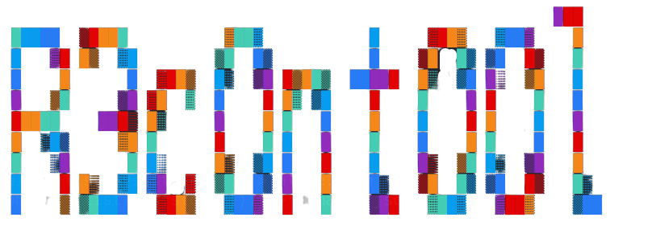

<!-- PROJECT LOGO -->
<br />
<div align="center">
  <a href="#">
    
  </a>

  <h2 align="center">ReconTool</h2>
  <p align="center">
    <a
      href="https://github.com/Shirshakhtml/Recontool/issues/new?assignees=&labels=bug">Report
      Bug</a>
    ·
    <a href="https://github.com/Shirshakhtml/Recontool/issues">Request Feature</a>
  </p>

  
  
  
   <br />  <br />

</div>

# About Recontool

*Recontool  is a new tool in Bash for Subdomain Enumeration. This tool will help you find the alive domains from a set of non-working domains and print the list of domains with status codes.*

## Requirements

- **Toilet and Figlet :** ```sudo apt install toilet figlet```
- **Go :** ```sudo apt install golang```
- **HTTPROBE :** ```go install github.com/tomnomnom/httprobe@latest```
- **Assetfinder :** ```go install github.com/tomnomnom/assetfinder@latest```
- **Sublist3r :** ```sudo apt install sublist3r```
- **HTTPX** (*requires go1.17*) **:** ```go install -v github.com/projectdiscovery/httpx/cmd/httpx@latest```  


After installing the above, move the Golang binaries to the /bin folder so that we can use them independently from any shell (You need to be in ```/home/kali/go/bin``` directory)  

- ```sudo cp httprobe /usr/bin```
- ```sudo cp assetfinder /usr/bin```
- ```sudo cp httpx /usr/bin```
  
## Usage 
```bash
bash recontool.sh target-site
```  
## License

Distributed under the MIT License. See `LICENSE.txt` for more information.

## PS
>This project was made using combination of tools made by [Tomnomnom](https://github.com/tomnomnom)

## Note
>*Everytime you run this tool you have to delete the files created as alive and domains.*